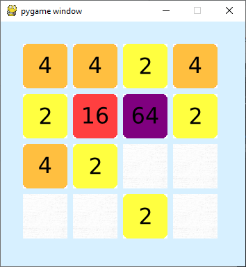

# 2048-clone-python
 2048 clone implemented in python
 
 Python 3.7.4
 
 Dependencies: Pygame
 
 Run ``python clone.pyw`` from command line or open with file explorer
 
 The superior version of this game can be found [here.](https://angelvilla.me/pages/clone.html) But if you really want to play this one, use 'wasd' keys to move, 'b' to undo a move, and 'p' to exit
 
 
